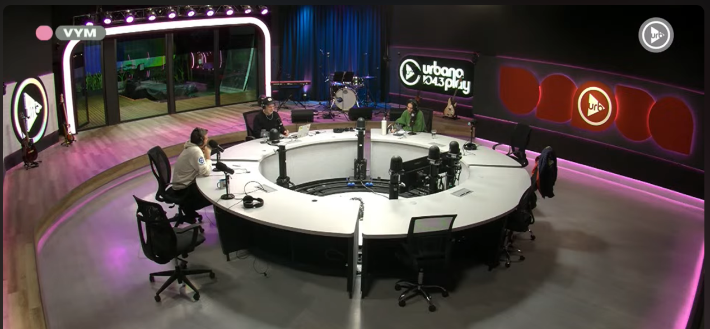
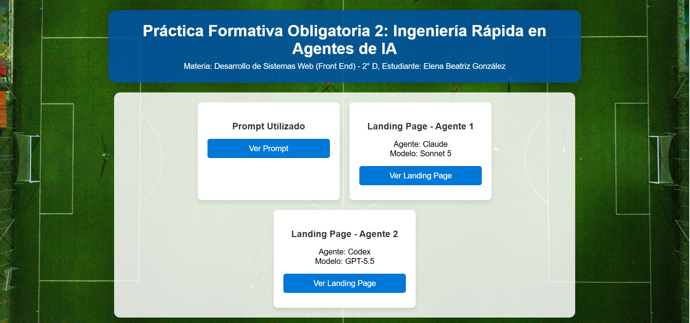
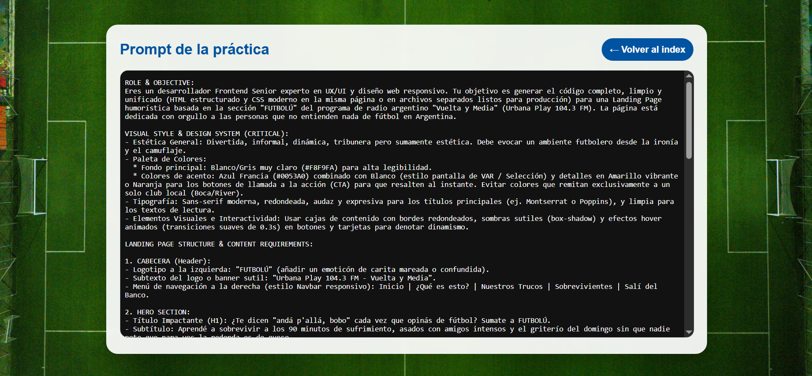
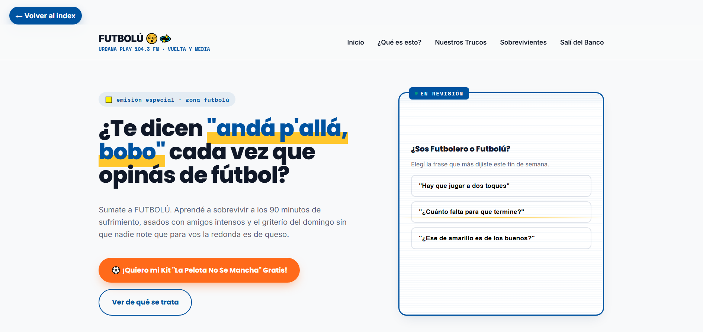
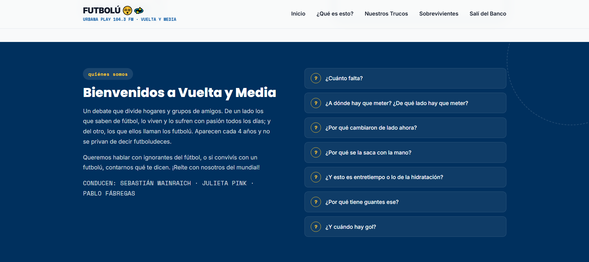
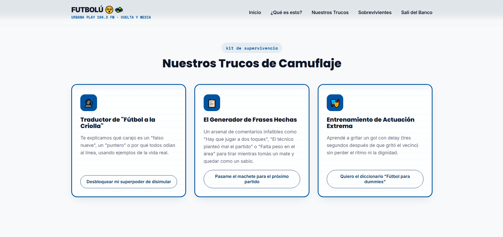
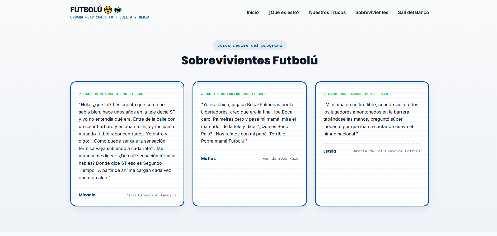
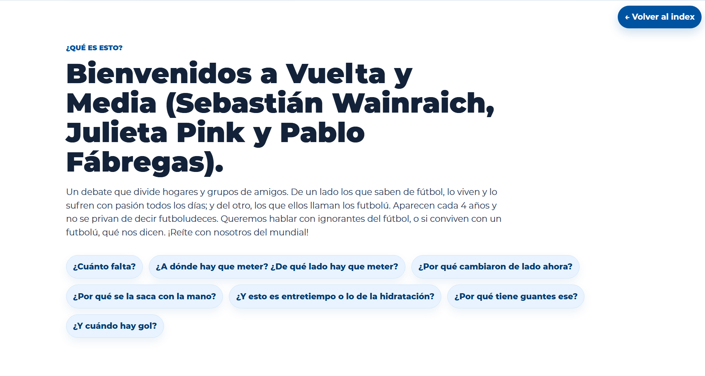
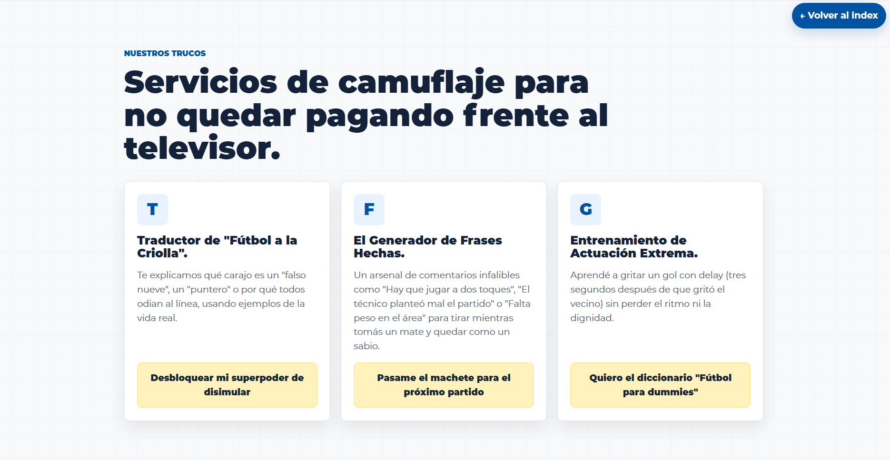
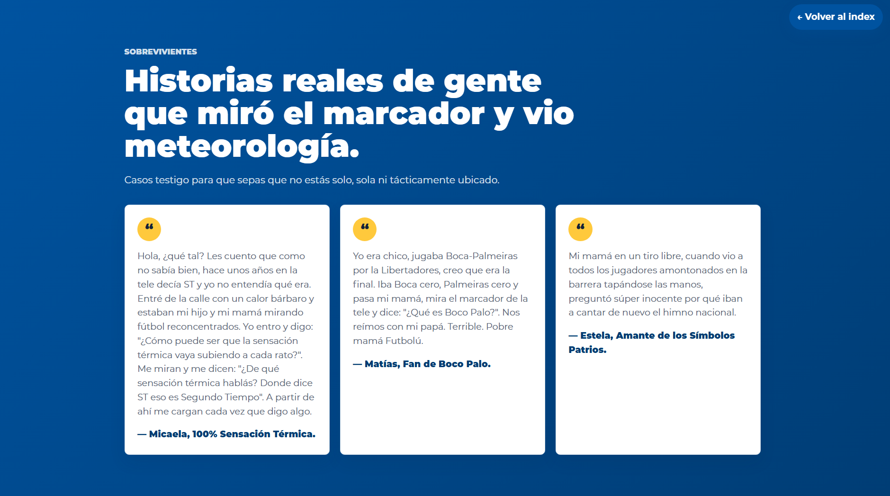

# PFO2 - FRONTEND: Prompt Ingeniería en Agentes de IA

## 👩‍🎓 Estudiante
- **Nombre y Apellido:** Elena Beatriz González
- **Comisión:** D (Lunes)
- **Institución:** IFTS N°29
- **Carrera:** Tecnicatura Superior en Desarrollo de Software
- **Año:** 2026 1C

## 💡 Inspiración
Este trabajo fue inspirado en el programa de radio Urbana Play 104.3 FM Vuelta y Media y la sección “Futbolú”.
Me resultó interesante y divertido en esta época de Mundial de Fútbol, hablar de las personas que entienden poco o nada sobre este deporte y que despierta un fanatismo sin igual en el resto.
Utilicé Gemini para que me diera ideas de cómo armar el diseño de la página, estilo visual, títulos llamativos, y así fui puliendo lo que sería el prompt definitivo.

## 📁 Repositorio GitHub
Puedes acceder al código fuente de este proyecto en el siguiente enlace:
[https://github.com/EBetGonzalez/PFO2-FRONTEND-GonzalezBeatriz](https://github.com/EBetGonzalez/PFO2-FRONTEND-GonzalezBeatriz)

## 🌐 Deploy unificado
La interfaz integradora que conecta a todos los agentes evaluados se encuentra desplegada en Vercel.

**Link:** [https://gonzalezbeatrizpfo2.vercel.app/index.html](https://gonzalezbeatrizpfo2.vercel.app/index.html)

## 📝 El prompt exacto utilizado
Este es el prompt exacto ejecutado en todos los agentes, sin alteraciones, respetando la restricción de no modificar el código generado manualmente; únicamente se agregó el botón con el enlace para volver al inicio.

## 🤖 Capturas de pantalla y enlaces de agentes

### Pantalla de Inicio

### Pantalla de Prompt

### Agente 1: Claude modelo Sonnet 5
- **Link al Agente 1:** [Ver despliegue](https://gonzalezbeatrizpfo2.vercel.app/Agente%201/futbolu-landing.html)
- **Capturas de pantalla:**
  - 
  - 
  - 
  - 
  - 

### Agente 2: Codex modelo GPT-5.5
- **Link al Agente 2:** [Ver despliegue](https://gonzalezbeatrizpfo2.vercel.app/Agente%202/outputs/index.html)
- **Capturas de pantalla:**
  - 
  - 
  - 
  - 
  - 

## 💡 Conclusión
Esta práctica permitió explorar las implicancias del alcance de la redacción de prompts y visualizar la resolución de los diferentes agentes de IA a partir de una misma especificación funcional.

La inclusión de la página principal unificada permitió comparar ambas propuestas, observar diferencias de diseño implementadas por cada herramienta y constatar que se siguió una estructura similar.
